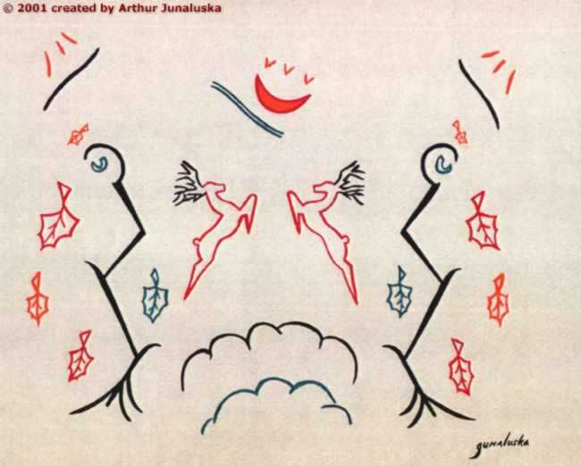

# The Dance of the Twelve Moons

I built this site in the year 2000 for an elderly neighbour, [Betty Smith Junaluska](https://www.heardfamilyhistory.org.uk/Junaluska.html), who passed in 2005.

She asked me to put her Cherokee husband Arthur Smith Junaluska (1912-1978) online, and for many years it was. I just noticed the hosting had expired, so I'm putting it back online, 26 years after it had first been posted.

https://dance-of-the-twelve-moons.org.uk

> He devised, choreographed, designed, directed and produced the Folk Ballet The Dance of the Twelve Moons. Based on the Native American Year of 12 Moons, or months, it comprises 12 traditional dances, with a narration that interweaves aspects of Arthur's life with the seasons. The ballet was performed in New York City, in North Carolina and also in the North West, with a cast of Native Americans. 

Via [heardfamilyhistory.org.uk](https://www.heardfamilyhistory.org.uk/Junaluska.html)
